  

 

 

## About

Full Stack Developer focused on building **web and mobile applications**.

I work across frontend, backend, APIs, databases and integrations using technologies such as **Python, FastAPI, React and Flutter**.

My main focus is building software that is clean, maintainable and ready to evolve into a real product.

---

## Tech Stack

### Development

  

### Data & Services

  

### Tools

---

## Areas I Work In

<table>
<tr>

<td width="33%" align="center" valign="top">

### 🌐 Web

**React · JavaScript · FastAPI**

Responsive web applications, dashboards and full-stack platforms.

</td>

<td width="33%" align="center" valign="top">

### 📱 Mobile

**Flutter · Dart · Firebase**

Cross-platform mobile applications with backend and cloud integrations.

</td>

<td width="33%" align="center" valign="top">

### ⚙️ Backend

**Python · FastAPI · PostgreSQL**

REST APIs, backend services, databases and system integrations.

</td>

</tr>
</table>

---

# Selected Work

<table>
<tr>

<td width="50%" valign="top">

## 🥗 NUDGE

### Nutrition & Coaching Platform

Cross-platform nutrition application combining food tracking, coaching and cloud-backed services.

**Built with**

`Flutter` `Firebase` `Cloud Functions` `REST APIs`

**Features**

* Authentication & user profiles
* Food search and tracking
* Cloud Functions backend
* Coaching system
* Push notifications
* Analytics infrastructure

 

</td>

<td width="50%" valign="top">

## 🧊 Fridge-AI

### Smart Food Management

Mobile application designed to simplify food inventory management and everyday kitchen workflows.

**Built around**

`Mobile` `Food Recognition` `Recommendations`

**Features**

* Food inventory management
* Product recognition
* Expiration tracking
* Recipe recommendations
* Mobile-first experience

 

</td>

</tr>

<tr>

<td width="50%" valign="top">

## ⚡ Energy Analyze AI

### Energy Analysis & Forecasting

Python-based system for analysing energy consumption and generating forecasting results through an interactive dashboard.

**Built with**

`Python` `Streamlit` `Forecasting`

**Features**

* Consumption analysis
* Forecasting pipeline
* Interactive dashboard
* Model comparison
* Automated reports

 

</td>

<td width="50%" valign="top">

## 🔐 AI Cipher Lab

### Interactive Cryptography Lab

Educational web application for experimenting with classical encryption methods through an interactive interface.

**Built with**

`FastAPI` `JavaScript` `HTML` `CSS`

**Features**

* Interactive cipher tools
* Multiple algorithms
* FastAPI backend
* Password analysis
* Educational interface

 

</td>

</tr>
</table>

---

## More Projects

<table>
<tr>
<td>

### 📄 Contract Analyze AI

Document and contract analysis application.

<a href="https://github.com/M0NAREKS/Contract-Analyze-AI">View project →</a>

</td>

<td>

### 🏥 Fall Risk

Fall-risk assessment application and backend system.

<a href="https://github.com/M0NAREKS/Fall_Risk">View project →</a>

</td>
</tr>
</table>

---

## Development Focus

---

## Contact

  

